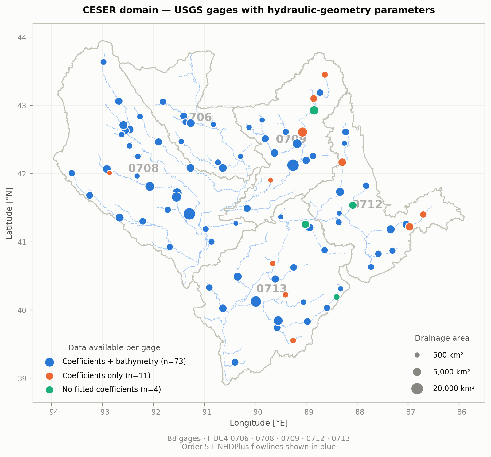
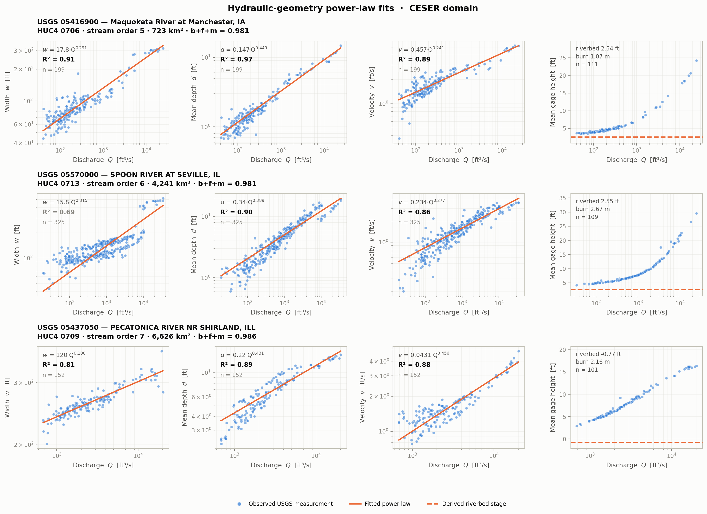
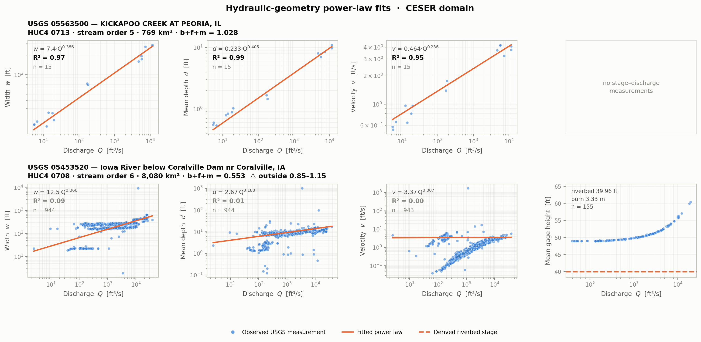

# CESER Domain — USGS Gage Hydraulic Geometry & Channel Bathymetry

Hydraulic-geometry power-law coefficients, DEM burn/bathymetry parameters, and the
underlying USGS field measurements for **88 stream gages** across the CESER modeling
domain (Upper Mississippi / Illinois River basins, HUC4 0706 · 0708 · 0709 · 0712 · 0713).

The package is **domain-wide and flat** — gages are not split by HUC4. Each gage appears
exactly once; a `huc4` column is kept for provenance only.



| | |
|---|---|
| Gages (total) | 88 |
| Gages with fitted hydraulic-geometry coefficients | 84 |
| Gages with DEM bathymetry / burn values | 73 |
| Gages with stage–discharge field measurements | 82 (9,183 measurements) |
| Gages with USGS channel measurements | 86 (44,251 measurements) |
| States | IL (41), IA (30), WI (11), IN (5), MN (1) |
| Stream order (NHDPlus) | 5 (67), 6 (18), 7 (3) |
| Drainage area | 309 – 20,154 km² |
| Bounding box | −93.596, 39.234 → −86.701, 43.636 (WGS84) |
| Total size | ~36 MB |

---

## Quick start

```bash
git clone <this-repo>
cd ceser_usgs_gage_hydraulic_geometry
pip install -r requirements.txt     # numpy, pandas, matplotlib — nothing geospatial
```

```python
import pandas as pd

# ALWAYS read site_id as a string: it is zero-padded and pandas will eat the leading 0
gages = pd.read_csv("data/gages.csv",                         dtype={"site_id": str, "huc4": str})
coef  = pd.read_csv("data/hydraulic_geometry_coefficients.csv", dtype={"site_id": str, "huc4": str})
bath  = pd.read_csv("data/channel_bathymetry.csv",              dtype={"site_id": str, "huc4": str})

# everything joins on site_id
df = gages.merge(coef, on="site_id", how="left").merge(bath, on="site_id", how="left")
```

Predicted width, depth and velocity at a given discharge (**imperial units** — see below):

```python
row = coef.set_index("site_id").loc["05416900"]
Q = 5000.0                                     # ft^3/s
w = row.coeff_a_width    * Q ** row.exp_b_width       # ft
d = row.coeff_c_depth    * Q ** row.exp_f_depth       # ft
v = row.coeff_k_velocity * Q ** row.exp_m_velocity    # ft/s

# continuity check: w * d * v should come back to Q
assert abs(w * d * v - Q) / Q < 0.05        # 5,070 vs 5,000 ft^3/s for this gage
```

Per-gage measurement files are named by site id:

```python
obs = pd.read_csv("data/channel_features/05416900.csv", dtype={"site_id": str})
sd  = pd.read_csv("data/field_measurements/05416900.csv", dtype={"site_id": str})
```

The `*_all.csv` files are the same data concatenated, if you would rather load once and
group by `site_id`.

---

## What is in the box

```
data/
├── gages.csv / .geojson                            88  master gage inventory + availability flags
├── hydraulic_geometry_coefficients.csv / .geojson  84  a,b,c,f,k,m power-law fits + goodness-of-fit
├── channel_bathymetry.csv / .geojson               73  riverbed elevation + DEM burn values (10 m & 30 m)
├── field_measurements/<site_id>.csv                82  stage–discharge pairs, per gage
├── field_measurements_all.csv                          all of the above concatenated
├── channel_features/<site_id>.csv                  86  USGS channel measurements, per gage
├── channel_features_all.csv                            all of the above concatenated
├── domain_boundary.geojson                          5  HUC4 outlines (for plotting)
└── streams.geojson                              6,285  order-5+ NHDPlus flowlines (for plotting)
```

Every column, type and unit is documented in **[DATA_DICTIONARY.md](DATA_DICTIONARY.md)**;
the equations behind every derived value are in **[METHODS.md](METHODS.md)**.

The `.geojson` twins carry identical attributes to their `.csv` counterparts as WGS84
points, so they drop straight into QGIS or ArcGIS with no conversion.

---

## What the coefficients mean

Leopold & Maddock (1953) at-a-station hydraulic geometry, fit independently per gage:

```
w = a · Q^b     (width)
d = c · Q^f     (mean depth = channel_area / channel_width)
v = k · Q^m     (velocity)
```

Fit by bounded non-linear least squares (`scipy.optimize.curve_fit`) on **untransformed**
values, with coefficients ≥ 1e-3 and exponents constrained to [0, 1]. Note that this is
least squares in linear space, not the usual log-space regression, so the fits track high
flows more closely than low ones — see **[METHODS.md](METHODS.md)** for the full math.

> **Units are imperial**, inherited from the USGS source: `Q` in ft³/s, `w` and `d` in ft,
> `v` in ft/s. The unit columns state this explicitly. The bathymetry file is in **metres** —
> the two files are not in the same unit system. Convert before feeding a metric model.

Theory expects `b + f + m ≈ 1`. The `exponent_sum` column reports the actual value and
`exponent_sum_in_range` flags whether it falls in 0.85–1.15 (**72 of 84 gages**).



*One well-fit gage per stream order. Left to right: the three fitted relations on log–log
axes, then the stage–discharge measurements with the derived riverbed stage that sets the
DEM burn depth.*

### Two different fits use two different inputs

| Output | Fit from | Variables |
|---|---|---|
| `hydraulic_geometry_coefficients` | `channel_features/` | `channel_flow`, `channel_width`, `channel_area`, `channel_velocity` |
| `channel_bathymetry` | `field_measurements/` | `MeanGageHeight`, `Discharge` (stage–discharge rating) |

`channel_bathymetry` reconstructs the riverbed measurement by measurement: for each
stage–discharge pair it takes the water-surface elevation (gage datum + stage) and
subtracts the water depth predicted by the fitted depth law, then keeps the minimum over
all measurements. Differencing that bed against the DEM gives `burn_value_m` — how far the
DEM must be lowered to seat the channel. Because the depth comes from the fit,
`riverbed_elev_m` inherits the depth fit's error directly: where `r2_depth` is poor, the
bed elevation is poor. Provided at both **10 m and 30 m** DEM resolution; only
`dem_elev_m` and `burn_value_m` differ between resolutions (69 of 73 gages), so the shared
columns are stored once rather than duplicated.

The full derivation, including every equation and the places this departs from textbook
practice, is in **[METHODS.md](METHODS.md)**.

Upstream inputs: USGS NWIS field measurements and channel measurements, GAGES-II station
metadata, NHDPlus stream order, and 10 m / 30 m DEMs (EPSG:5070).

---

## Reproducing the figures

Both scripts write into `figures/` and need only numpy, pandas and matplotlib.

```bash
python3 scripts/plot_domain.py                        # figures/domain_overview.png
python3 scripts/plot_gage_fits.py                     # figures/gage_fits.png
```

`plot_gage_fits.py` takes arguments:

```bash
python3 scripts/plot_gage_fits.py --sites 05416900 05570000     # specific gages
python3 scripts/plot_gage_fits.py --best 6                      # 6 highest mean-R² gages
python3 scripts/plot_gage_fits.py --sites 05563500 --out figures/kickapoo.png
```

With no arguments it picks one well-fit gage per stream order.

---

## Filter on fit quality before you use these coefficients

**This is the thing to get right.** Fit quality varies enormously between gages, and the
package ships the numbers you need to screen on: `r2_width`, `r2_depth`, `r2_velocity`
(recomputed against the same observations the fit used) and `exponent_sum_in_range`.



*Same pipeline, two well-sampled gages. The Wapsipinicon River (top, n = 192) is a clean
power law — depth and velocity are tight, and width is the loosest of the three, as it
usually is. The Iowa River below Coralville Dam (bottom, n = 944) is dam-regulated: the
measurements split into separate branches, no power law can describe them, and R² collapses
to ~0 — but the row still exists in the file and still carries coefficients that look
perfectly ordinary until you check `r2_*`.*

A reasonable screen:

```python
usable = coef[
    (coef.n_relations_fitted == 3) &        # all three fits actually converged
    (coef.r2_width    >= 0.7) &
    (coef.r2_depth    >= 0.7) &
    (coef.r2_velocity >= 0.7) &
    (coef.exponent_sum_in_range == 1)
]
```

That strict screen leaves **14 of 84 gages**. Loosen it per relation if you only need one
of the three — e.g. depth alone (`r2_depth >= 0.7`) keeps 58.

**Do not screen on `exponent_sum_in_range` alone.** When a fit fails, the coefficient is
stored as null but its exponent keeps the value 0.0, and `exponent_sum` still adds that
zero in. Gage 05466500 has a failed velocity fit yet sums to 1.089, inside the valid band —
the flag would wave it through. `n_relations_fitted` (3 = all converged; 78 gages, 5 have
2, 1 has 1) is the column that catches it.

Median R² across the domain: **0.62** (width), **0.83** (depth), **0.71** (velocity). Only
25 of 84 gages reach R² ≥ 0.7 on width — width is the weakest of the three, because
at-a-station width often varies little with discharge in incised channels.

Also check `n_fit_points`: a high R² on 15 measurements is not the same as a high R² on
900. The highest mean-R² gage in the domain has only 15 points.

---

## Known limitations

1. **Fit quality varies a lot** — see the section above. Filter, don't assume.
2. **Width fits are the weakest** of the three relations.
3. **Some coefficients are null** where the fit did not converge: `coeff_c_depth`
   (3 gages), `coeff_k_velocity` (4 gages) — 6 gages affected in total. The matching
   exponent is stored as **0.0, not null**, and still enters `exponent_sum`, so a failed
   relation can leave a gage looking valid. Screen on `n_relations_fitted == 3`.
4. **Vertical datum is unverified.** `datum_type` is `Unknown` for all 84 gages in the
   coefficient source, though the field measurements report NAVD88 for 8,725 of 9,183
   rows. Treat `riverbed_elev_m` and `burn_value_m` as NAVD88-assumed, not datum-verified.
5. **`burn_value_m` is positive-only by construction.** The upstream step kept a gage only
   where the DEM sat above the computed riverbed. Gages needing no burn were dropped, which
   is most of the 84 → 73 attrition. The 73 are a biased subset, not a census.
6. **Least squares was done in linear space, not log space** (§1.3 of
   [METHODS.md](METHODS.md)), which weights high flows far more than low ones. Fine for
   flood work; think twice for low-flow applications.
7. **`riverbed_elev_m` inherits the depth fit's error** — it is built from the fitted
   depth law, not from measured depths, and is taken as a minimum over measurements, so a
   single outlier can set it.
8. **The Manning-inversion variant is not included.** The upstream tree also contains
   `bathymetry_parameter_summary_manning_method_{10,30}.geojson`, but those files are
   identical in content to the curve-fit outputs for all 73 gages — they carry the
   curve-fit schema, not the Manning-inversion schema the code produces. They are stale
   artifacts of an earlier run and were excluded deliberately.

---

## Rebuilding from source

`build_package.py` regenerates `data/` from the per-HUC4 source tree. It is deterministic
and safe to re-run; it overwrites outputs in place.

```bash
python3 build_package.py
```

Source tree: `Illinois_HiPIMS/data/huc_ceser/dataset/huc_<id>/`. The two plotting
basemaps (`domain_boundary.geojson`, `streams.geojson`) were exported once from the
upstream GeoPackages and are committed here, so rebuilding does not require geopandas.

---

## Citation and licence

USGS field measurements are public-domain US federal data. The derived coefficients and
burn values are products of this work — **add a licence file before publishing** (CC-BY-4.0
for the data plus MIT for the code is a common pairing) and a citation once there is a DOI
or paper to point at.
